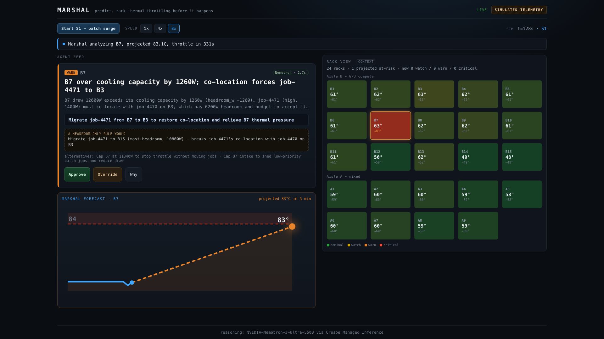
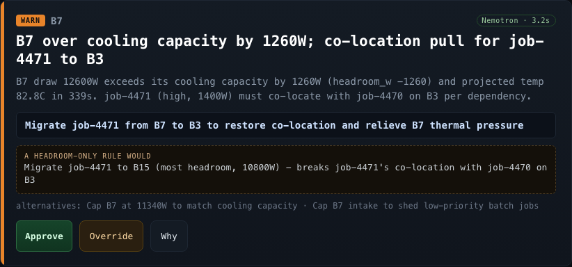
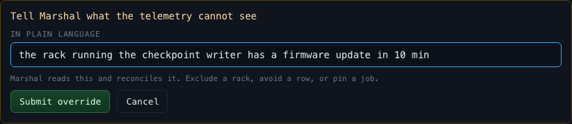
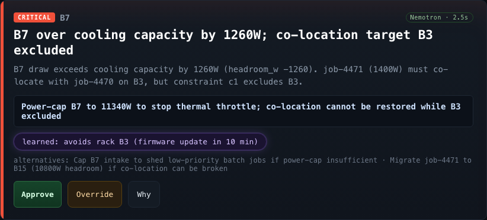
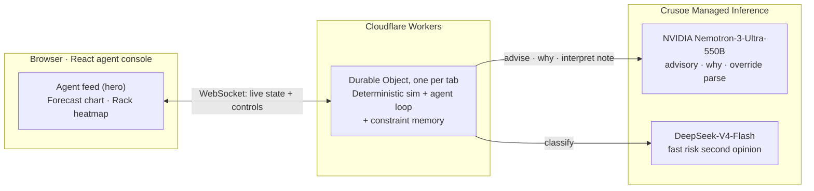
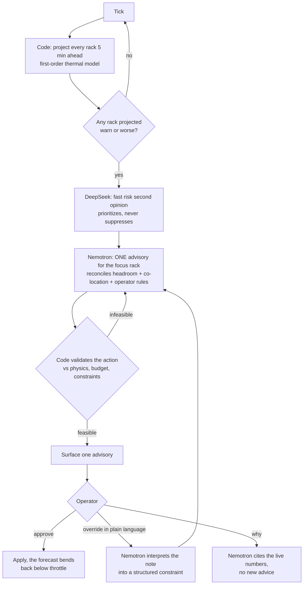

# Marshal

**Predicts GPU rack thermal throttling about five minutes before it happens, and hands a shift engineer one constraint-aware fix to approve, override, or question.** An agent console, not a dashboard.

[**Live demo**](https://marshal.neverboringnow.workers.dev) &nbsp;·&nbsp; [**1-min demo video**](https://youtu.be/WtLlCCnGc3o) &nbsp;·&nbsp; Crusoe track &nbsp;·&nbsp; RAISE Summit Hackathon, July 2026 &nbsp;·&nbsp; solo, remote



Marshal watches a simulated GPU data center, sees a rack heading for its 84&nbsp;C throttle line while it still looks fine, and gives the on-shift engineer a single decision: move this job here, or power-cap that rack, with the reasoning and the pick a naive rule would have made shown side by side. Every number is computed in code from a cited thermal model; the language model does only the part rules cannot. It runs live on NVIDIA Nemotron-3-Ultra-550B via Crusoe Managed Inference, on Cloudflare Workers and Durable Objects.

---

## Why a language model, not a rule

The whole pitch is that the model does two things a fixed rule set provably cannot, and Marshal shows both on screen rather than asserting them.

### 1. It reconciles a job's co-location dependency

When rack B7 goes over its cooling capacity, its high-priority job `job-4471` must stay co-located with its gradient partner `job-4470`, which runs on B3. A headroom-only rule grabs B15, the emptiest rack, and breaks the dependency. Marshal migrates to B3 instead, even though B3 has far less headroom, and the advisory card puts both picks side by side: the rule's flawed choice next to the model's.



### 2. It interprets a plain-language override

The operator types a note the telemetry cannot know, in plain language, including one that names a rack only by description: *"the rack running the checkpoint writer has a firmware update in 10 min."* Nemotron reads the live rack and job list, resolves "checkpoint writer" to the `ckpt-9` job on B3, and turns the sentence into a structured `exclude_rack B3` constraint that every later decision must respect. A regex can pull "B3" out of a note that literally says "B3"; it cannot resolve a description. That resolution is the step only the model can do.



Then Marshal re-solves in seconds and learns the rule. With B3 excluded, co-location can no longer be restored, so migrating fixes nothing; Marshal power-caps B7 non-destructively instead, holding it under throttle without shedding the high-priority job. When a second rack later hits the same wall, it power-caps that one on its own too, carrying the same learned constraint, without being told again.



Verified on the real model, not just the mock: the co-location pick (`scripts/probe_reasoning.mjs`, B3 over B15 in 3/3 runs) and the constraint interpretation (`scripts/probe_constraint.mjs`, 5/5 including 2 description-only cases), both end to end on the deployed Worker.

---

## Architecture

A stateful agent runs inside one Durable Object per browser tab. It holds the sim and the agent loop, streams the world over a WebSocket, and calls two Crusoe-hosted models. Code owns every number and the safety gates; the models do language and judgment.



## How the agent decides, every tick

Code triages from the physics. The heavy model fires rarely, only on a rack the projection already flagged, and only its judgment (which action, reconciling which constraints) is trusted; code validates the result against physics before the engineer ever sees it.



---

## Real vs simulated

Honesty matters for judging, so the boundary is explicit and shown in the UI.

- **Real:** the agent loop, Crusoe Managed Inference on NVIDIA Nemotron-3-Ultra-550B, the constraint reconciliation (including a job's co-location dependency), the model turning a plain-language override into a code-validated structured constraint, the live temperature forecast the agent draws, the override-to-learning loop, and the feasibility validation that rejects an infeasible action before it reaches the engineer. The card also shows what a headroom-only rule would have done, so the model's advantage is demonstrated, not claimed. Live advisories carry a green `Nemotron · Xs` chip with the real call latency; the offline mock is labeled `simulated model`.
- **Simulated:** the rack telemetry and the cluster. A first-order lumped-capacitance thermal model, anchored on cited H100 specs (see `docs/SIM_SPEC.md`), gives temperatures real multi-minute inertia, which is what makes a five-minute prediction legitimate rather than a straight-line gimmick. A permanent `SIMULATED TELEMETRY` badge is always visible.

## Inference

Two tiers, both on Crusoe Managed Inference (OpenAI-compatible), called from the Cloudflare Worker with thinking disabled for structured output:

- `nvidia/NVIDIA-Nemotron-3-Ultra-550B` generates the advisory, the Why explanation, and the natural-language override interpretation.
- `deepseek-ai/Deepseek-V4-Flash` is a fast per-rack risk second opinion. Code owns the authoritative triage from the projection; the classifier only prioritizes and can never suppress a physics-flagged advisory.

Verified against the live endpoint:

- Both model strings resolve; thinking disabled via top-level `chat_template_kwargs`; structured JSON via `response_format: {type:"json_object"}` validates against the Advisory zod schema on Nemotron Ultra (`npm run probe`, 8/8).
- The model turns a plain-language operator note into a structured constraint (`exclude_rack`, `avoid_row`, or `pin_job`, plus a target and reason), including notes that name the rack or job only by description, in 5/5 probe cases, 2 of them description-only (`npm run probe:constraint`, for example "the rack running the checkpoint writer" to `exclude_rack B3`). Code then validates the resolved id against the live world, with a deterministic regex fallback, so a mis-parse cannot invent a phantom rack.
- Co-location reasoning works on the real model, not just the mock: Nemotron migrates the job to its partner's rack (B3) over the emptiest rack (B15) in 3/3 runs and adapts when B3 is excluded (`npm run probe:reasoning`).
- Latency: classification about 0.8 to 1.1s, advisory 2.5 to 4.6s, Why 0.9 to 1.2s.

The exact request shape and error rules are in `docs/CRUSOE_NOTES.md`; the provider is `src/inference/inference.ts`. The full agent contract is `docs/AGENT_SPEC.md`; the thermal model and its executable oracle are `docs/SIM_SPEC.md` and `scripts/curve_check.mjs`.

## Run it

```
npm install
npm run curve          # thermal oracle: proves the sim constants, no network
npm run check          # typecheck + unit tests
MOCK=1 npm run dev     # offline app on the deterministic mock, no key needed
```

For real inference, put `CRUSOE_API_KEY` in `.dev.vars`, set `MOCK=0`, then `npm run dev`.

## Deploy

```
npm run deploy         # bakes MOCK=0 into the build, deploys to Cloudflare, restores the source
```

The committed `wrangler.jsonc` keeps `MOCK=1` so local dev and the smoke test run offline without a key; the deploy script sets `MOCK=0` for the built artifact only. Set the inference secret once with `npx wrangler secret put CRUSOE_API_KEY`.

## Track and bonus

- **Crusoe track.** This is the Crusoe track's Statement Three example built for real: a GPU cluster agent that fuses telemetry to predict rack-level thermal throttling and surfaces a one-tap, constraint-aware migration a non-technical operator can trust, override, and teach.
- **NVIDIA bonus.** The advisory, the Why, and the override interpretation all run on NVIDIA Nemotron, the load-bearing reasoning in the product.
- **Cloudflare.** Deployed live on Cloudflare Workers and Durable Objects, the stateful WebSocket runtime for the agent.

## License

MIT. See `LICENSE`.
